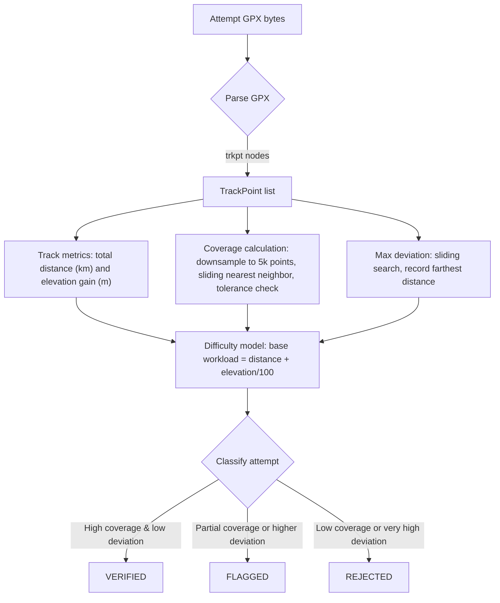

# GPX Calculation Flowchart

**Notes**
- Parsing is DOM-based, extracting latitude/longitude plus optional elevation and time for each `<trkpt>`.
- Distance uses Haversine between consecutive points; elevation gain sums positive deltas.
- Coverage and max deviation share the downsampling + sliding nearest-neighbor strategy against the official route.
- Difficulty score combines distance, elevation, coverage bonus, and deviation penalty, floored at zero.
- The classifier uses coverage and deviation thresholds to determine the final status.
