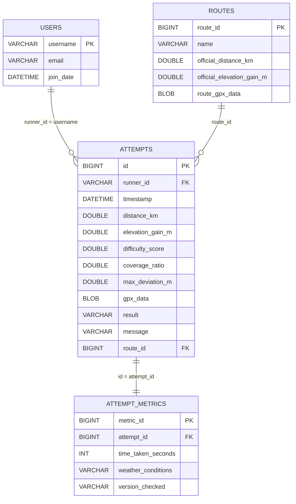

# Attempt Verifier Database Relationships

The diagram below summarizes the core tables and their key relationships for the Attempt Verifier database.

- **USERS → ATTEMPTS**: Each user can have multiple attempts, linked via `runner_id` to `users.username`.
- **ROUTES → ATTEMPTS**: Attempts can be associated with a route through `route_id`.
- **ATTEMPTS → ATTEMPT_METRICS**: Each attempt can have an optional one-to-one metrics record via `attempt_id`.

# JDBC and Database Components

## DataSource configuration
- `src/main/resources/application.properties` sets the MySQL JDBC URL, credentials, and driver class for Spring Boot’s auto-configured `DataSource`.
- Schema initialization is disabled (`spring.sql.init.mode=never`) because SQL scripts are managed manually.
- Helpful JDBC debugging is available by enabling Spring’s JDBC binding logs.

## Repository layer (JdbcTemplate)
- `AttemptRepository` wires `JdbcTemplate` through constructor injection and uses a dedicated `RowMapper` to map result set columns to `Attempt` fields, including optional metrics and GPX data.
- `save` inserts attempts with generated key handling and null-safe binding for optional metrics and GPX bytes.
- Query helpers cover fetching all attempts, lookups by ID, and filters by runner ID and/or result.
- `resetAll` clears the `attempts` table and resets auto-increment to support clean test runs.

## Domain model note
- `Attempt` is a plain Java object with persistence handled manually through `AttemptRepository` rather than JPA annotations.