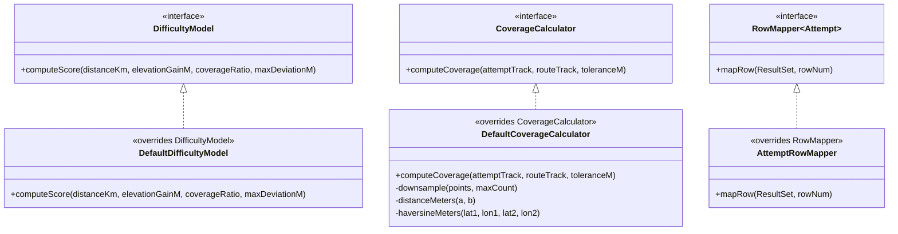
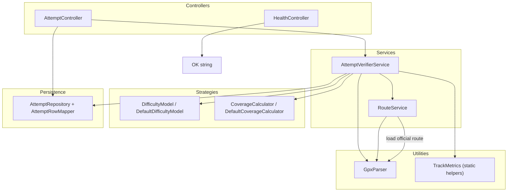

# OOP Relationship Diagrams

The diagrams below visualize the main inheritance, implementation, and composition links across the codebase, highlighting overridden methods where they occur.

## Interfaces and Implementations

## Service Composition and Strategy Use

**Key override notes**
- `DefaultDifficultyModel.computeScore` replaces the strategy defined by `DifficultyModel` to compute non-negative scores from distance, elevation, coverage bonus, and deviation penalty.【F:src/main/java/org/trail/attemptverifier/service/oop/DefaultDifficultyModel.java†L5-L34】
- `DefaultCoverageCalculator.computeCoverage` implements the downsampling nearest-neighbour approach defined by `CoverageCalculator`, using private helpers for distance math.【F:src/main/java/org/trail/attemptverifier/service/oop/DefaultCoverageCalculator.java†L5-L88】
- `AttemptRepository.AttemptRowMapper.mapRow` overrides Spring's `RowMapper` to hydrate `Attempt` entities including optional doubles and BLOB notes.【F:src/main/java/org/trail/attemptverifier/repository/AttemptRepository.java†L20-L54】

**Composition highlights**
- `AttemptVerifierService` coordinates repository, route loading, GPX parsing, static `TrackMetrics`, and swappable strategy objects (`DifficultyModel`, `CoverageCalculator`).【F:src/main/java/org/trail/attemptverifier/service/AttemptVerifierService.java†L28-L173】
- `RouteService` caches the official route GPX using `GpxParser` and Spring's `ResourceLoader` for downstream consumers.【F:src/main/java/org/trail/attemptverifier/service/RouteService.java†L5-L45】
- `AttemptController` depends on `AttemptVerifierService` for verification and `AttemptRepository` for querying attempts; DTOs remain simple data holders without inheritance.【F:src/main/java/org/trail/attemptverifier/controller/AttemptController.java†L17-L190】
