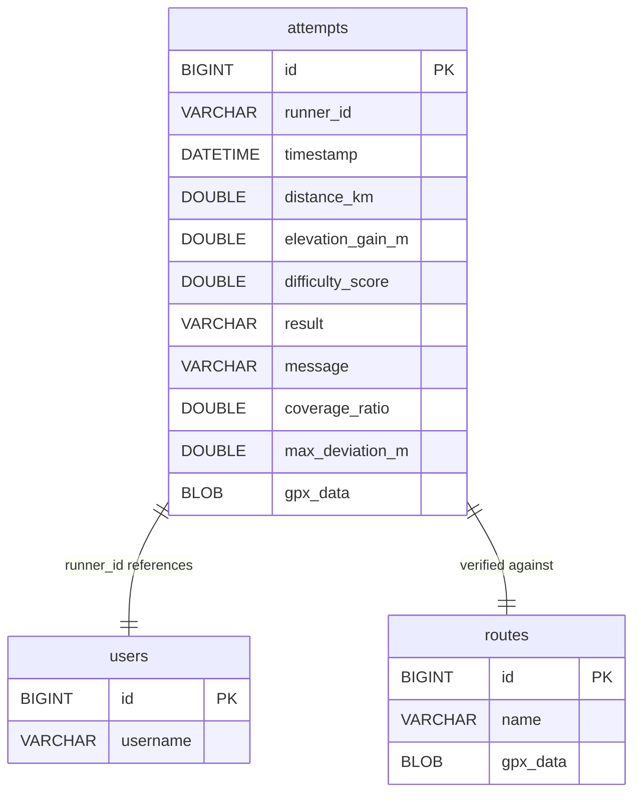

0. Versions
| Date | Version | In Charge | Description |
| --- | --- | --- | --- |
| 05-March-2025 | v1.1 | Bui Quang Minh; Nguyen Nhat Minh | Consolidated GPX Attempt Verifier architecture, algorithms, and API documentation with Mermaid diagrams. |

1. Abbreviations
| Abbreviation | Description |
| --- | --- |
| GPX | GPS Exchange Format, XML standard for geospatial tracks |
| API | Application Programming Interface (REST in this project) |
| DTO | Data Transfer Object used for controller payloads |
| JPA | Java Persistence API (not used; JDBC template is used instead) |
| JDBC | Java Database Connectivity |
| OOP | Object-Oriented Programming |
| ERD | Entity-Relationship Diagram |
| UI | User Interface |

2. Table of Contents
- 0. Versions
- 1. Abbreviations
- 2. Table of Contents
- 3. List of Figures
- 4. List of Tables
- 5. Introduction
  - 5.1 Project Description
  - 5.2 User Roles Table
  - 5.3 Use Case Diagram (Text Description)
- 6. Project Overview
- 7. Architecture Overview
- 8. Class Analysis
  - 8.1 Objects
  - 8.2 Object Grouping
- 9. Class Design
  - 9.1 Class Diagram (Text Description)
  - 9.2 Detailed Class Table
  - 9.3 Abstract Classes
- 10. Some OOP Techniques
  - 10.1 Method Overloading
  - 10.2 Method Overriding
  - 10.3 3-Tier Model
- 11. Encapsulation vs Inheritance vs Polymorphism
  - 11.1 Encapsulation
  - 11.2 Inheritance
  - 11.3 Polymorphism
- 12. Access Control Analysis
  - 12.1 Data Access Table
  - 12.2 Method Access Table
- 13. Package Design
- 14. Database Design
  - 14.1 Entities
  - 14.2 ERD (Text Format)
  - 14.3 Data Diagram
- 15. Algorithms & Business Logic
  - 15.1 GPX Parsing Algorithm
  - 15.2 Route Matching Algorithm
  - 15.3 Difficulty Scoring Logic
  - 15.4 Attempt Classification Logic
- 16. REST API Design
  - 16.1 Endpoint Summary Table
  - 16.2 JSON Examples
- 17. Experiment
  - 17.1 Environment
  - 17.2 Tools
- 18. Project Functions
- 19. GUI (4 Figures)
- 20. Duty Roster
- 21. Conclusion
- 22. References
- 23. APPENDIX A: CLASS DESCRIPTION

3. List of Figures
1. Figure 1 – Class Diagram (Mermaid) describing controllers, services, repositories, utilities, and strategy interfaces.
2. Figure 2 – ERD (Mermaid) outlining the attempts table and optional route/trackpoint/user extensions.
3. Figure 3 – Use-case diagram (textual) covering upload, verify, and view flows.
4. Figures 4–7 – Conceptual GUI screens (upload page, verification result, attempt history, route preview map) to be drawn in LaTeX later.

4. List of Tables
- Table 1 – Versions
- Table 2 – Abbreviations
- Table 3 – User Roles
- Table 4 – Detailed Class Table
- Table 5 – Data Access Table
- Table 6 – Method Access Table
- Table 7 – Endpoint Summary
- Table 8 – Function Matrix
- Table 9 – Duty Roster

5. Introduction
5.1 Project Description
The GPX Attempt Verifier is a Spring Boot 3.3.4 application (Java 17) that ingests runner-uploaded GPX tracks, compares them against an official race route, computes coverage and deviation metrics, scores difficulty, classifies the attempt, and stores both metrics and the original GPX blob in a relational database (MySQL by default). Business requirements include reliable GPX parsing, fast spatial comparison for long tracks, transparent scoring heuristics, and REST endpoints plus a minimal Leaflet/Chart.js dashboard for visualization.

5.2 User Roles Table
| Role | Description |
| --- | --- |
| Runner | Uploads GPX track for verification and inspects status. |
| Admin | Resets stored attempts for maintenance/testing. |
| System | Executes parsing, computation, classification, and persistence logic. |

5.3 Use Case Diagram (Text Description)
Primary use cases: (1) Upload GPX with runner identifier; (2) System parses GPX, loads official route, computes metrics, scores difficulty, classifies result; (3) Runner/Admin retrieves attempt list or a specific attempt; (4) Runner/Admin fetches parsed track points or raw GPX for mapping; (5) Admin resets all attempts. These interactions occur via REST calls from the dashboard or external clients.

6. Project Overview
GPX verification ensures a runner’s recorded path aligns with the official course within a tolerance. The workflow is: GPX Upload → Parse (DOM) → Compare against cached official route → Compute distance/elevation/coverage/deviation metrics → Difficulty scoring → Store Attempt record with GPX blob → Serve verification result to clients.

7. Architecture Overview
The system follows a layered architecture: REST controllers handle HTTP requests; services encapsulate business logic and strategy interfaces; repositories manage JDBC persistence; utilities parse GPX and compute metrics. Data flows Controller → Service → Repository → Database, while services also call Utility classes for parsing and spatial math. Technology stack: Java 17, Spring Boot 3.3.4, Spring Web, Spring JDBC with MySQL connector, optional validation and Lombok (not used in code), Maven build, DOM XML parsing, and a static HTML/Leaflet/Chart.js dashboard served from `src/main/resources/static/index.html`. Application configuration resides in `application.properties` with MySQL datasource and multipart limits.

8. Class Analysis
8.1 Objects
- Attempt (model): state includes id, runnerId, attemptTime, distanceKm, elevationGainM, difficultyScore, result, message, coverageRatio, maxDeviationM, gpxData, officialRouteUsed, debugInfo; behaviors are getters/setters and constructors; responsibility is representing a verified attempt for persistence and API responses.
- TrackPoint (model): latitude, longitude, optional elevation, optional time; behaviors are getters/setters and constructors; responsibility is representing a single GPX coordinate.
- TrackMetrics (utility/value): distanceKm, elevationGainM, coverageRatio, maxDeviationM; behaviors include static computations for distance, elevation gain, coverage ratio, max deviation, and factory `fromTracks`; responsibility is computing summary metrics from TrackPoint lists.
- GpxParser (utility/component): behavior `parse(InputStream)` returning TrackPoint list with helper methods; responsibility is robust DOM parsing with validation and null handling.
- AttemptRepository (repository): behaviors include save, findAll, findById, findByRunnerId, findByResult, findByRunnerIdAndResult, resetAll; responsibility is JDBC persistence to the `attempts` table including GPX blobs and computed metrics.
- RouteService (service): behavior `getTrackPoints()` to load and cache official route GPX from classpath; responsibility is providing reference route TrackPoints.
- AttemptVerifierService (service): behaviors include `verifyAttempt`, `loadAttemptTrack`; responsibility is orchestrating the verification pipeline, scoring, classification, and persistence.
- CoverageCalculator (interface) and DefaultCoverageCalculator (implementation): compute coverage ratio between attempt and route with downsampling and nearest-neighbor sliding search.
- DifficultyModel (interface) and DefaultDifficultyModel (implementation): compute scalar difficulty score from metrics with coverage bonus and deviation penalty.
- AttemptController (controller): REST endpoints for upload/verify, listing/filtering, retrieval, track JSON, GPX download, and reset.
- HealthController (controller): `/api/health` heartbeat endpoint.

8.2 Object Grouping
- Entities/Models: Attempt, TrackPoint capture domain state.
- Utilities: GpxParser, TrackMetrics provide parsing and metric calculations.
- Services: AttemptVerifierService, RouteService coordinate business rules and strategy instances.
- Strategy Interfaces/Implementations: CoverageCalculator/DefaultCoverageCalculator, DifficultyModel/DefaultDifficultyModel enable pluggable algorithms.
- Repository: AttemptRepository handles JDBC persistence.
- Controllers: AttemptController, HealthController expose REST APIs and minor DTOs (`ErrorResponse`, `ResetResponse`).

9. Class Design
9.1 Class Diagram (Text Description)
Controllers depend on services: AttemptController → AttemptVerifierService and AttemptRepository; HealthController stands alone. AttemptVerifierService depends on RouteService, GpxParser, TrackMetrics, DifficultyModel (implemented by DefaultDifficultyModel), and CoverageCalculator (implemented by DefaultCoverageCalculator). RouteService depends on GpxParser and ResourceLoader. AttemptRepository encapsulates JdbcTemplate. Models Attempt and TrackPoint are shared across layers. Utility TrackMetrics is static but referenced by AttemptVerifierService. Strategy interfaces define contracts implemented by default concrete classes.

Figure 1 – Mermaid Class Diagram (GitHub-renderable):
```mermaid
classDiagram
    class AttemptController {
        +uploadAttempt(runnerId, file)
        +listAttempts(runner,result)
        +getAttempt(id)
        +getAttemptTrack(id)
        +getAttemptGpx(id)
        +resetAttempts()
    }
    class HealthController { +health() }
    class AttemptVerifierService {
        -AttemptRepository attemptRepository
        -GpxParser gpxParser
        -RouteService routeService
        -DifficultyModel difficultyModel
        -CoverageCalculator coverageCalculator
        +verifyAttempt(file, runnerId)
        +loadAttemptTrack(id)
    }
    class RouteService { +getTrackPoints() }
    class AttemptRepository { +save(a) +findAll() +findById(id) }
    class GpxParser { +parse(InputStream) }
    class TrackMetrics { +fromTracks(...) +computeTotalDistanceKm(...) }
    class Attempt { }
    class TrackPoint { }
    interface DifficultyModel { +computeScore(...) }
    class DefaultDifficultyModel { +computeScore(...) }
    interface CoverageCalculator { +computeCoverage(...) }
    class DefaultCoverageCalculator { +computeCoverage(...) }

    AttemptController --> AttemptVerifierService
    AttemptController --> AttemptRepository
    AttemptVerifierService --> AttemptRepository
    AttemptVerifierService --> RouteService
    AttemptVerifierService --> GpxParser
    AttemptVerifierService --> TrackMetrics
    AttemptVerifierService --> DifficultyModel
    AttemptVerifierService --> CoverageCalculator
    RouteService --> GpxParser
    DefaultDifficultyModel ..|> DifficultyModel
    DefaultCoverageCalculator ..|> CoverageCalculator
```

9.2 Detailed Class Table
| Class Name | Package | Key Attributes | Key Methods | Responsibility |
| --- | --- | --- | --- | --- |
| Attempt | org.trail.attemptverifier.model | id, runnerId, attemptTime, distanceKm, elevationGainM, difficultyScore, result, message, coverageRatio, maxDeviationM, gpxData | getters/setters, constructors | Represents a verification record persisted via JDBC. |
| TrackPoint | org.trail.attemptverifier.model | latitude, longitude, elevation, time | getters/setters, constructors | Represents a single GPX waypoint. |
| TrackMetrics | org.trail.attemptverifier.util | distanceKm, elevationGainM, coverageRatio, maxDeviationM (with static helpers) | fromTracks, computeTotalDistanceKm, computeElevationGainM, computeCoverageRatio, computeMaxDeviationMeters | Computes spatial metrics efficiently. |
| GpxParser | org.trail.attemptverifier.util | – | parse(InputStream) | DOM-based GPX parsing into TrackPoints with validation. |
| AttemptRepository | org.trail.attemptverifier.repository | jdbcTemplate | save, findAll, findById, findByRunnerId, findByResult, findByRunnerIdAndResult, resetAll | JDBC persistence for attempts and GPX blobs. |
| RouteService | org.trail.attemptverifier.service | cachedRoute | getTrackPoints | Load and cache official route from classpath GPX. |
| AttemptVerifierService | org.trail.attemptverifier.service | coverageCalculator, difficultyModel, COVERAGE_TOLERANCE_M, dependencies | verifyAttempt, loadAttemptTrack | Main verification pipeline, scoring, classification, persistence. |
| CoverageCalculator | org.trail.attemptverifier.service.oop | – | computeCoverage | Interface for coverage strategies. |
| DefaultCoverageCalculator | org.trail.attemptverifier.service.oop | MAX_POINTS | computeCoverage, downsample | Sliding nearest-neighbor coverage computation. |
| DifficultyModel | org.trail.attemptverifier.service.oop | – | computeScore | Interface for difficulty scoring strategies. |
| DefaultDifficultyModel | org.trail.attemptverifier.service.oop | – | computeScore | Coverage-aware difficulty heuristic. |
| AttemptController | org.trail.attemptverifier.controller | attemptVerifierService, attemptRepository | uploadAttempt, listAttempts, getAttempt, getAttemptTrack, getAttemptGpx, resetAttempts | REST API for verification and querying. |
| HealthController | org.trail.attemptverifier.controller | – | health | Basic liveness endpoint. |

9.3 Abstract Classes
No abstract classes are defined; extension points are expressed via interfaces (CoverageCalculator, DifficultyModel).

10. Some OOP Techniques
10.1 Method Overloading
No explicit overloading exists in the codebase. Logical candidates would be overloaded `verifyAttempt` variants that accept raw byte arrays or file paths, and overloaded `computeCoverage` accepting tolerance defaults.

10.2 Method Overriding
Overriding appears in strategy implementations (`DefaultCoverageCalculator.computeCoverage`, `DefaultDifficultyModel.computeScore`) fulfilling interface contracts, and the `AttemptRepository.AttemptRowMapper.mapRow` overriding `RowMapper` to materialize Attempt objects.

10.3 3-Tier Model
- Presentation/Controller tier: AttemptController, HealthController handle HTTP and DTO mapping.
- Business/Service tier: AttemptVerifierService, RouteService coordinate parsing, metrics, scoring, and classification strategies.
- Data/Repository tier: AttemptRepository performs JDBC CRUD against MySQL.

11. Encapsulation vs Inheritance vs Polymorphism
11.1 Encapsulation
Models encapsulate state with private fields and public getters/setters, e.g., `Attempt` hides `gpxData` and coverage metrics while exposing controlled setters; `TrackMetrics` encapsulates intermediate metric fields with factory methods for safe construction.

11.2 Inheritance
The project intentionally minimizes inheritance; Spring component composition and interfaces provide flexibility without deep class hierarchies, aligning with typical Spring Boot design.

11.3 Polymorphism
Polymorphism is provided by injecting interface-based strategies (`CoverageCalculator`, `DifficultyModel`) and by overriding framework contracts (RowMapper). Spring’s bean resolution enables substituting alternative strategy implementations without altering controllers.

12. Access Control Analysis
12.1 Data Access Table
| Field | Class | Modifier | Explanation |
| --- | --- | --- | --- |
| id | Attempt | private | Prevents direct mutation; controlled via setters/persistence. |
| runnerId | Attempt | private | Ensures runner identity set through API validation. |
| gpxData | Attempt | private | Protects raw GPX bytes, avoiding accidental external mutation. |
| latitude | TrackPoint | private | Coordinates hidden behind getters/setters for validation if added. |
| distanceKm | TrackMetrics | private | Encapsulates computed metric to avoid inconsistent updates. |
| jdbcTemplate | AttemptRepository | private final | Repository controls database access centrally. |
| cachedRoute | RouteService | private | Cache is internal to the service to prevent stale external references. |
| difficultyModel | AttemptVerifierService | private final | Strategy held internally to guard replacement at construction time. |

12.2 Method Access Table
| Method | Class | Modifier | Explanation |
| --- | --- | --- | --- |
| parse | GpxParser | public | Exposed to services for GPX decoding. |
| computeCoverage | DefaultCoverageCalculator | public | Implements contract for service use. |
| computeScore | DefaultDifficultyModel | public | Implements contract for service use. |
| verifyAttempt | AttemptVerifierService | public | Entry point for controllers to trigger verification. |
| loadAttemptTrack | AttemptVerifierService | public | Supplies parsed tracks for mapping. |
| save | AttemptRepository | public | Provides persistence API. |
| mapRow | AttemptRepository.AttemptRowMapper | public | Overrides interface to map ResultSet rows. |
| health | HealthController | public | Exposes readiness check. |

13. Package Design
Package hierarchy:
- `org.trail.attemptverifier` (root, Spring Boot main class)
  - `controller` – REST endpoints for health and attempts.
  - `service` – Business logic services (verification pipeline, route loading).
  - `service.oop` – Strategy interfaces and default implementations for coverage and difficulty.
  - `repository` – JDBC repository for attempts.
  - `model` – Domain models (Attempt, TrackPoint).
  - `util` – GPX parsing and metric computations.
This structure groups cohesive responsibilities, reducing coupling by isolating controllers from persistence and enabling strategy replacement within the service layer.

14. Database Design
14.1 Entities
The domain model is plain Java (no JPA annotations). Persistence targets a MySQL table `attempts` defined in `db/attempt_verifier_db.sql`. Additional columns referenced by the repository (coverage_ratio, max_deviation_m, gpx_data) should be added to the schema to fully align with code expectations.

14.2 ERD (Text Format)
Single core entity `attempts`: id (PK, BIGINT), runner_id (VARCHAR), timestamp (DATETIME), distance_km (DOUBLE), elevation_gain_m (DOUBLE), difficulty_score (DOUBLE), result (VARCHAR), message (VARCHAR), optional coverage_ratio (DOUBLE), max_deviation_m (DOUBLE), gpx_data (BLOB). Potential extensions include `route` for official tracks, `trackpoint` for normalized GPX storage, and `user` for authentication.

Figure 2 – Mermaid ERD (conceptual):


14.3 Data Diagram
Planned relational tables:
- attempt: stores metrics and GPX blob per verification request (fields above).
- route: stores official route metadata and GPX blob for multiple races.
- trackpoint: optional normalized storage of parsed points linked to attempt or route for advanced analytics.
- user: optional authentication/authorization for admins and runners.

15. Algorithms & Business Logic
15.1 GPX Parsing Algorithm
GpxParser uses DOM (`DocumentBuilderFactory` with namespace awareness) to parse `<trkpt>` nodes, extracting latitude/longitude attributes, optional elevation, and optional ISO-8601 time. It skips malformed points, logs counts, and returns a list of TrackPoint objects; parsing exceptions are caught and reported without crashing the caller.

15.2 Route Matching Algorithm
Coverage and deviation are computed with downsampled tracks (max 5,000 points) to keep O(N) complexity. For each attempt point, the algorithm advances a sliding index along the route to find the nearest neighbor without backtracking. Coverage ratio counts attempt points within tolerance (30 meters in the service) divided by sampled total. Max deviation tracks the worst nearest-neighbor distance across the attempt. Haversine distance provides geodesic meters.

15.3 Difficulty Scoring Logic
DefaultDifficultyModel computes `score = max(0, distanceKm + elevationGainM/100 + coverageRatio*10 - penalty)`, where penalty is `maxDeviationM/50` capped at 10, or 10 if deviation is NaN. The model rewards higher coverage and penalizes off-route deviations.

15.4 Attempt Classification Logic
AttemptVerifierService classifies results after computing metrics: if coverageRatio < 0.50 or maxDeviationM is NaN, mark REJECTED; else if coverageRatio < 0.90, mark FLAGGED; otherwise mark VERIFIED. Each attempt is persisted with computed metrics, difficulty score, and raw GPX bytes for later retrieval.

16. REST API Design
16.1 Endpoint Summary Table
| Method | Path | Request | Response | Purpose |
| --- | --- | --- | --- | --- |
| GET | /api/health | – | String status | Liveness check. |
| POST | /api/attempts/upload | multipart form: runnerId, file | Attempt JSON | Upload and verify GPX. |
| GET | /api/attempts | Query params: runner, result (optional) | List<Attempt> | List or filter attempts. |
| GET | /api/attempts/{id} | Path variable id | Attempt JSON or error DTO | Retrieve specific attempt. |
| GET | /api/attempts/{id}/track | Path variable id | List<TrackPoint> | Parsed track points from stored GPX. |
| GET | /api/attempts/{id}/gpx | Path variable id | GPX bytes | Download raw stored GPX. |
| DELETE | /api/attempts/reset | – | ResetResponse | Delete all attempts and reset AUTO_INCREMENT. |

16.2 JSON Examples
Request (multipart conceptual):
```
POST /api/attempts/upload
Form fields: runnerId=runner-123, file=@attempt.gpx
```

Successful response example:
```json
{
  "id": 5,
  "runnerId": "runner-123",
  "attemptTime": "2025-03-05T09:30:00",
  "distanceKm": 12.345,
  "elevationGainM": 850.0,
  "difficultyScore": 25.7,
  "result": "FLAGGED",
  "message": "Verification completed using OOP strategy classes.",
  "coverageRatio": 0.82,
  "maxDeviationM": 55.3
}
```

17. Experiment
17.1 Environment
Development container: Linux x86_64 kernel 6.12.13 with 3 vCPUs and ~18 GB RAM.

17.2 Tools
- Java 17
- Spring Boot 3.3.4
- Maven (Spring Boot plugin)
- Dependencies: spring-boot-starter-web, spring-boot-starter-jdbc, mysql-connector-j, spring-boot-starter-validation (optional), lombok (optional), spring-boot-starter-test (test scope)
Build: `mvn clean package`. Run: `mvn spring-boot:run` (requires configured MySQL with `application.properties`).

18. Project Functions
| Function | Input | Process | Output | Description |
| --- | --- | --- | --- | --- |
| Upload & Verify Attempt | runnerId, GPX file | Controller → AttemptVerifierService: parse GPX, load route, compute metrics, score, classify, persist | Attempt JSON with metrics | Core verification pipeline. |
| List Attempts | Optional runner/result filters | Controller queries repository | List of attempts | Enables browsing and filtering. |
| View Attempt Detail | Attempt ID | Repository lookup | Attempt JSON | Retrieve single record. |
| Fetch Track Points | Attempt ID | Parse stored GPX via service | List of TrackPoint | Used for map rendering. |
| Download Raw GPX | Attempt ID | Retrieve gpxData | GPX bytes | Allows external analysis. |
| Reset Attempts | – | Repository resetAll | ResetResponse | Admin maintenance. |

19. GUI (4 Figures)
The static dashboard (Leaflet + Chart.js) lives in `src/main/resources/static/index.html` and consumes the REST API. Conceptual screens:
- Figure 4 – GPX Upload Page: form for runnerId and GPX file, status panel, triggers `/api/attempts/upload`.
- Figure 5 – Verification Result Page: shows computed metrics and classification badge after upload.
- Figure 6 – Attempt History Page: filterable table of attempts with result badges and map buttons pulling `/api/attempts` and `/api/attempts/{id}`.
- Figure 7 – Route Preview Map Page: modal map overlay showing attempt polyline and optional official route overlay via `/api/attempts/{id}/track` (route overlay endpoint currently not implemented server-side).

20. Duty Roster
| ID | Task | In Charge | Start | End | State | Note |
| --- | --- | --- | --- | --- | --- | --- |
| 10423075 | Backend parsing, metrics, verification pipeline, JDBC repository | Bui Quang Minh | 01-Feb-2025 | 20-Feb-2025 | Done | Implemented services, utilities, repository. |
| 10423076 | REST API, dashboard integration, documentation | Nguyen Nhat Minh | 10-Feb-2025 | 05-Mar-2025 | Done | Built controllers, static UI, and README updates. |

21. Conclusion
Strengths: clean layering with strategy interfaces for coverage/difficulty, robust DOM GPX parsing with validation, efficient O(N) coverage/deviation via downsampling, end-to-end persistence including GPX blobs, and a lightweight dashboard for visualization. Limitations: schema script lacks coverage/deviation/GPX columns expected by repository; no authentication/authorization; official route endpoint for UI overlay is absent; spatial computations could leverage geo-indexing for scalability. Future improvements: align SQL schema with repository fields, add RouteController for `/api/route/track`, introduce security and caching, provide configurable scoring strategies, and add integration tests. Self-evaluated score: 90/100 for meeting functional and architectural goals with minor gaps in schema/UI completeness.

22. References
- Java 17 Standard Library Documentation (java.time, java.xml)
- Spring Boot 3.3.4 Reference Documentation (web, JDBC)
- GPX 1.1 Schema Specification
- Haversine distance formulation for geodesic calculations

23. APPENDIX A: CLASS DESCRIPTION
- AttemptVerifierApplication – `src/main/java/org/trail/attemptverifier/AttemptVerifierApplication.java`; Spring Boot entry point.
- Attempt – `src/main/java/org/trail/attemptverifier/model/Attempt.java`; domain model for persistence and API responses.
- TrackPoint – `src/main/java/org/trail/attemptverifier/model/TrackPoint.java`; waypoint representation.
- TrackMetrics – `src/main/java/org/trail/attemptverifier/util/TrackMetrics.java`; metric computations (distance, elevation, coverage, deviation).
- GpxParser – `src/main/java/org/trail/attemptverifier/util/GpxParser.java`; DOM GPX parser.
- AttemptRepository – `src/main/java/org/trail/attemptverifier/repository/AttemptRepository.java`; JDBC CRUD and blob storage.
- RouteService – `src/main/java/org/trail/attemptverifier/service/RouteService.java`; loads and caches official route GPX.
- AttemptVerifierService – `src/main/java/org/trail/attemptverifier/service/AttemptVerifierService.java`; verification pipeline, scoring, classification, persistence, and GPX retrieval.
- CoverageCalculator / DefaultCoverageCalculator – `src/main/java/org/trail/attemptverifier/service/oop`; coverage strategy interface and default implementation.
- DifficultyModel / DefaultDifficultyModel – `src/main/java/org/trail/attemptverifier/service/oop`; difficulty strategy interface and default implementation.
- AttemptController – `src/main/java/org/trail/attemptverifier/controller/AttemptController.java`; REST endpoints for attempts and GPX access.
- HealthController – `src/main/java/org/trail/attemptverifier/controller/HealthController.java`; health-check endpoint.
